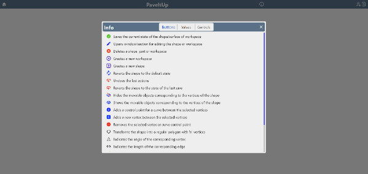
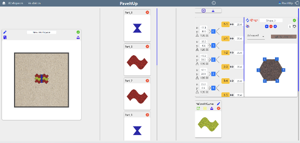

# Pavement Design Platform

This project is a **full-stack design platform** for creating and simulating complex pavement shapes.  
It was structured with separate folders for **frontend (Angular)** and **backend (Express.js with Sequelize and PostgreSQL)**, each with its own dependencies.

## Features

- **Shape Design**
  - Start from default shapes or generate custom ones with any number of vertices
  - Create **straight or curved lines**, with full control over curvature
  - Manually move vertices or adjust geometry using controls:
    - Change angles between lines
    - Modify lengths
    - Enforce identical or perpendicular angles
    - Move adjacent vertices or incident lines
  - Extensive **keyboard shortcuts** for faster editing
  - Customize **textures and colors** of generated shapes

- **Surface Simulation**
  - Define custom surface areas
  - Place designed shapes inside to simulate real-world placement
  - Export a set of instructions for real-world implementation  
    (future scope: physical manufacturing and delivery of shapes)

- **Collaboration**
  - Publish shapes and workspaces for others to import, reuse, and extend
  - Request customer service support by describing a desired shape  
    (team responds with a generated shape)

- **Guidance**
  - Built-in documentation with **instructions for all controls, buttons, and accepted input values**

- **Authentication**
  - **JWT-based authentication and authorization**
  - Email validation on sign-up
  - Password reset functionality

- **Architecture**
  - Frontend: **Angular** with **Three.js** for rendering
  - Backend: **Express.js** + **Sequelize ORM**
  - Database: **PostgreSQL**

## Tech Stack

- **Frontend:** Angular, Three.js
- **Backend:** Express.js, Sequelize, JWT
- **Database:** PostgreSQL
- **Deployment:** Local environment (no remote hosting)

## About

This project was developed as part of my **Master’s Degree**, showcasing advanced full-stack development while also exploring computational geometry and interactive design.  
The platform combines procedural shape generation, 3D rendering, and collaborative features to provide a practical tool for both creative experimentation and real-world pavement design simulation.

## Preview

  
   
  <em>Authentication system with login, registration, email validation, and password reset.</em>

  
   
  <em>Instructions menu showing guidance for all controls and input values.</em>

  
   
  <em>Workspace with shape generation controls, textures, and a surface area for placement.</em>

